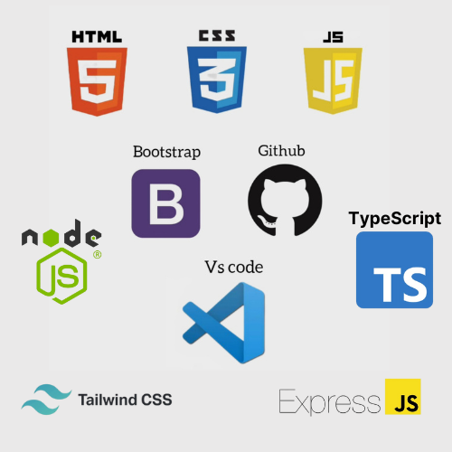

# CareCove

CareCove is a platform dedicated to fostering a more inclusive society, ensuring that people from all backgrounds—children, 
parents, and individuals alike—have access to essential opportunities, clean water, nutritious food, and quality education.
The platform seeks to ensure that everyone feels represented, supported, and empowered to make a difference, ensuring no one faces their journey alone, no matter their societal challenges.


## Problem
In 2024, despite the widespread belief that the world has become technologically advanced, countless people in third-world countries 
continue to face life-threatening challenges. In Nigeria, we still witness tragic reports of deaths caused by preventable diseases 
like cholera due to a lack of clean water. Many affected communities receive little to no assistance. 
The northern region of Nigeria has also endured relentless violence from Boko Haram insurgencies, leaving countless families without shelter, 
and forced to live in constant fear. Heartbreaking stories of abandoned children and desperate parents struggling to provide for their families are all too common.

It is devastating to watch children—who should be the future drivers of societal growth—cry in despair, 
while parents are left in a state of helplessness and disappointment. Nigeria is just one example, 
but other African countries face similar challenges. From lack of necessities like clean water and shelter to the ongoing toll of the conflict, 
the situation across the continent paints a grim picture. These are not just isolated incidents but systemic issues that require 
urgent attention and sustainable solutions


## Why Are We Here?
CareCove is here to bring joy and hope, starting with Africa. 
Our mission is to unite with NGOs and donors across the globe who share a deep passion for humanity. 
We stand as the voice of the people, showing the world that together, we can achieve true unity. 
In a world that can be divided, we believe in the power of kindness to create beauty, change lives, and uplift communities. 
Let’s build a future where compassion knows no boundaries and where every act of kindness brings us closer to oneness.


## Access CareCove [here](https://carecove.vercel.app/#/)


## Key Features of the Application
* A space where NGOs can find the assistance they need to make society a better place.
* We aim to connect NGOs to Philanthropists who are readily available to donate to causes.
* These NGOs will contact CareCove to create causes.
* A wallet for Donors who intend to send money in different currencies supported by tbDEX SDK.
* Every donation from these philanthropists will be received by CareCove

## CareCove Structure
* An NGO contacts us to create a cause, by submitting the name of the NGO, contact information and cause details.

* We go through their submission, send a series of emails and possibly hop on calls to ensure the genuineness of these NGOs.

* If genuine, we approve the cause and upload it on CareCove.

* Philanthropists/Donors come to our Application and decide to donate to a particular cause.

* They need to create a wallet account by signing up first. This account allows CareCove to manage customers' verifiable credentials and DIDs.

* Donors should have some money in his/her wallet. (These currencies must be supported by the tbDEX SDK)

* Donors can select a cause to donate to and proceed by clicking on donate.

* If a donor has USD in their wallet, they send USD and select whatever currency they want to donate.

* Select exchange rate offerings.

* Input amount.

* Money automatically comes to CareCove.

* Request for Quote

* And Quote will be shown in recent transactions.

* The donor decides to proceed with donating by clicking on Pay or they may decide to cancel the transaction.
  
## Building the WebApp


In this guide, we will be discussing our solution and how we built 
our web app using technologies like Vs Code, HTML, CSS, Bootstrap, JavaScript, Tailwind, Node.Js, Express.Js, Typescript, Firebase and Github.

## Defining the workflow


## Project objective
Our project is a web application focused on building a more 
inclusive society by ensuring that everyone—children, parents, and individuals 
from all walks of life have access to opportunities, clean water, good food, and quality education.
This is achieved by connecting NGOs to Philanthropists.

## Design Considerations
### Profitability


### Optionability
CareCove handles matching offerings from multiple PFIs by showing the rates of each PFIs for the donors to select themselves.


### Customer Management
CareCove manage donors DIDs and verifiable credentials by storing and retrieving their DIDs and verifiable credentials from both online secure database (firebase firestore) and offline database (localstorage).
Donor DIDs were required to be stored online so that they can manage there accounts and and tracking previous transaction when they make change of device.


### Customer Satisfaction
Donors satisfaction with PFIs are being tracked by showing a rating submission form to rate how satisfied they were with the PFI used for a particular transaction.
Every rating is being stored to gather satisfactory information.

## Web application structure
This web application consists of:

* A landing page - This is where CareCove's branding is implemented.  
The header contains our objectives. The body contains the features and content of the Web Application.

* Donation page - Using the tbDEX SDK, philanthropists can create a wallet for them to donate money in any currency supported by the SDK.

* Sponsor page - Here, CareCove is calling out for sponsorship/partnership.

* About us page - This is where one can find information about CareCove, Our vision, mission, sponsors etc.

* Contact us page - NGOs can contact CareCove to create causes and CareCove approves them on the Web Application after carefully going through the causes.

* Causes - Carries a list of all approved causes.

## Repository Structure
```sh
└── CareCove/
    ├── .github
    │   ├── FUNDING.yml
    │   └── workflows
    ├── README.md
    ├── app.vue
    ├── assets
    │   ├── css
    │   └── loading.gif
    ├── components
    │   ├── Balances.vue
    │   ├── Credentials.vue
    │   ├── Header.vue
    │   ├── Spinner.vue
    │   ├── Toast.vue
    │   ├── TransactionModal.vue
    │   └── Transactions.vue
    ├── data_providers
    │   └── data.js
    ├── dist
    ├── firebase.json
    ├── images
    │   ├── Images1.jpg
    │   ├── Images2.jpg
    │   ├── Images3.png
    │   └── favicon.ico
    ├── nuxt.config.ts
    ├── package-lock.json
    ├── package.json
    ├── pages
    │   ├── credentials.vue
    │   ├── dashboard.vue
    │   ├── donate.vue
    │   └── login.vue
    ├── public
    │   ├── about.html
    │   ├── assets
    │   ├── blog-details.html
    │   ├── blog.html
    │   ├── causes-details.html
    │   ├── causes.html
    │   ├── contact.html
    │   ├── event-details.html
    │   ├── index.html
    │   └── sponsor.html
    ├── rollup.config.js
    ├── src
    │   └── firebaseConfig.js
    ├── tailwind.config.js
    └── tsconfig.json
```

### Prerequisites

**Vue.js**: `v5.4.5

### Installation

Build the project from source:

1. Clone the CareCove repository:
```sh
❯ git clone https://github.com/A-bee01/CareCove
```

2. Navigate to the project directory:
```sh
❯ cd CareCove
```

3. Install the required dependencies:
```sh
❯ npm install
```

### Usage

To run the project, execute the following command:

```sh
❯ npm run dev
```
then open http://localhost:3000 on your browser to preview.

## Technologies used 


### [Visual studio code](https://code.visualstudio.com/download)
This is a software application used for editing, testing packaging and developing codes efficiently.

### [HTML](https://html.com/) 
HTML is a language for describing the structure 
of Web pages. HTML gives authors the means to Publish online documents with headings, 
text, tables, lists, images, etcetera.

### [CSS](https://developer.mozilla.org/en-US/docs/Web/CSS)
This is to describe the 
presentation of Web pages, including colours, layout, and fonts.

### [Bootstrap](https://getbootstrap.com/) 
Bootstrap is a free CSS open-source front-end 
development framework for the creation of websites and web apps designed to enable 
responsive development.

### [JavaScript](https://www.javascript.com/) 
Javascript is used to create dynamic
and interactive web content like applications and browsers. 

### [Github](https://docs.github.com/en/get-started/quickstart/hello-world)
This is a code hosting platform for version control and collaboration. It lets 
you and others work together on projects from anywhere.

### [Tailwind](https://tailwindcss.com/)
Tailwind is a utility-first CSS framework that provides pre-designed classes to help developers quickly build custom, 
responsive web layouts without writing custom CSS. It focuses on flexibility and speed, allowing easy styling directly in HTML.

### [Express.Js](https://expressjs.com/)
Express.js is a fast, minimal web application framework for Node.js, designed to build web and mobile applications. 
It simplifies handling requests, routing, and server-side logic, making it easier to create robust, scalable web applications.

### [Node.Js](https://nodejs.org/en)
Node.js is a runtime environment that allows developers to run JavaScript on the server side. 
It’s built on Chrome's V8 engine and is known for enabling fast, scalable, and efficient applications, especially for real-time or data-intensive tasks.

### [Typescript](https://www.typescriptlang.org/)
TypeScript is a programming language that extends JavaScript by adding static types. 
It allows developers to catch errors early and write more robust, maintainable code, while still being compatible with existing JavaScript libraries and frameworks.

These technologies were put together to build our Web Application.


## Future Progression
* NGOs will be verified directly on CareCove and thereafter upload causes themselves.

* Donors/Philanthropists can reach out and send money directly to NGOs.

* Philanthropists might like to see where their donations are going. To ensure that these donors feel their money is being used properly, we will incorporate a dashboard detailing how the money is distributed. 

* Gamify the experience, give these donors badges based on their donations, celebrating milestones and leaderboards. 

* They can also share their milestones with their social media cycle


