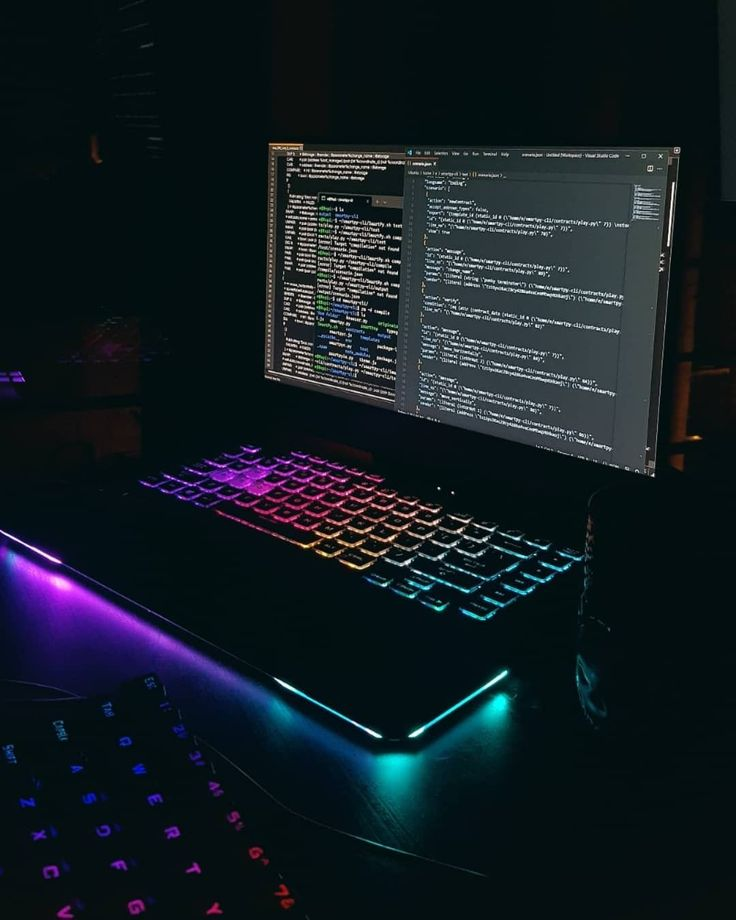

# CareCove

CareCove is a platform dedicated to fostering a more inclusive society, ensuring that people from all backgrounds—children, 
parents, and individuals alike—have access to essential opportunities, clean water, nutritious food, and quality education.
The platform seeks to ensure that everyone feels represented, supported, and empowered to make a difference, ensuring no one faces their journey alone, no matter the societal challenges they encounter.

## Problem
In 2024, despite the widespread belief that the world has become technologically advanced, countless people in third-world countries 
continue to face life-threatening challenges. In Nigeria, we still witness tragic reports of deaths caused by preventable diseases 
like cholera due to a lack of clean water. Many affected communities receive little to no assistance. 
The northern region of Nigeria has also endured relentless violence from Boko Haram insurgencies, leaving countless families without shelter, 
and forced to live in constant fear. Heartbreaking stories of abandoned children and desperate parents struggling to provide for their families are all too common.

It is devastating to watch children—who should be the future drivers of societal growth—cry in despair, 
while parents are left in a state of helplessness and disappointment. Nigeria is just one example, 
but similar challenges are faced by other African countries. From lack of necessities like clean water and shelter to the ongoing toll of the conflict, 
the situation across the continent paints a grim picture. These are not just isolated incidents but systemic issues that require 
urgent attention and sustainable solutions

## Why Are We Here?
CareCove is here to bring joy and hope, starting with Africa. 
Our mission is to unite with NGOs and donors across the globe who share a deep passion for humanity. 
We stand as the voice of the people, showing the world that together, we can achieve true unity. 
In a world that can be divided, we believe in the power of kindness to create beauty, change lives, and uplift communities. 
Let’s build a future where compassion knows no boundaries and where every act of kindness brings us closer to oneness.

## Access CareCove [here](https://carecove.vercel.app/#/)

## Key Features of the Application
* A space where NGOs in need of help/sponsorship can find the assistance they need to make society a better place.
* We aim to connect NGOs to Philanthropists who are readily available to donate to causes.
* These NGOs contact CareCove to create causes.
* A wallet for both NGOs and Donors for sending and receiving money.
* Every donation from these philanthropists will be received in $USD no matter the currency used then can also be sent out to the NGOs in their currencies if supported by tbDEX. This is to say;

When an NGO from Nigeria or any other country adds a cause and a Philantopists donate with NGN, KES, GHS etc, CareCove will receive it in USD and when CoreCove wants to send it out to the NGO that created that particular cause, it will be sent as NGN, GHS, KES and any other currency as far as it supported by tbDEX.

## Building the WebApp

In this guide, we will be discussing our solution and how we built 
our web app using technologies like Vs Code, HTML, CSS, Bootstrap, JavaScript, Tailwind, Node.Js, Express.Js, Typescript and Github.

## Defining the workflow

  
